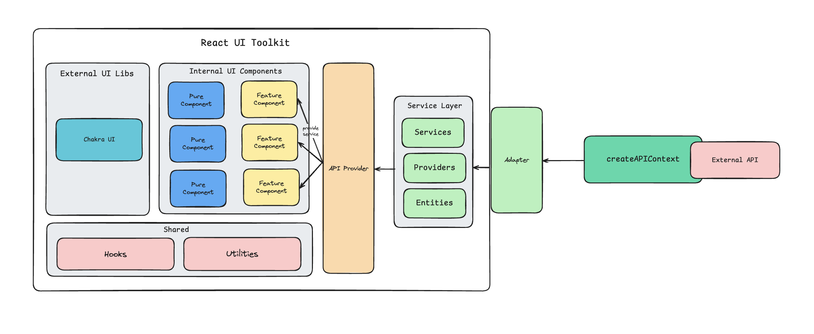

# 🌸 Origami UI Toolkit

Welcome to the Origami UI Toolkit! This project is a monorepo designed to provide a collection of reusable UI components, hooks, and services for building robust and scalable React applications. It emphasizes a clear separation of concerns, modularity, and testability, making it easy to develop and maintain complex user interfaces.

---

## ✨ Features

- **Reusable UI Components**: A growing library of well-tested and accessible React components (e.g., Button, Select).
- **Modular Architecture**: Clear separation of UI, logic, and API interaction layers.
- **API Agnostic Services**: Services designed to interact with any external API through flexible providers, enhancing reusability and testability.
- **Custom Hooks**: Encapsulate complex logic and data fetching, providing clean interfaces for components.
- **Monorepo Structure**: Manages multiple related packages (ui-toolkit, playground, server) within a single repository using pnpm workspaces.
- **Developer Experience**: Includes linting, testing, and build configurations for a smooth development workflow.

---

## 📐 Architecture Overview

The origami-ui-toolkit is structured into several distinct layers to ensure modularity, maintainability, and testability.

<!-- Image from ./assets/arch-at-a-glance.png to show the arch overview -->

<p align="center">
  
</p>

---

## 🧠 Key Interactions

- **Services Layer**: Defines interfaces (e.g., `PicklistProvider`) and implements business logic for interacting with external APIs (`PicklistService`).
- **Context Layer**: The `APIProvider` makes instances of services available throughout the React component tree.
- **Hooks Layer**: Custom hooks (e.g., `useGetPicklist`) consume services from the context to fetch and manage data.
- **Features Layer**: Higher-order components (`Picklist`) combine UI components and logic for specific functionalities.
- **Components Layer**: Reusable atomic UI elements (`Button`, `Select`) render the UI.

This design promotes **loose coupling**, enabling adaptability to various backend implementations.

---

## 📂 Project Structure

This is a `pnpm` monorepo with the following structure:

```
origami-ui-toolkit/
├── apps/
│   ├── playground/         # React app for demonstrating UI-Toolkit
│   └── server/             # Simple Node.js/Express backend
├── packages/
│   └── ui-toolkit/         # Core UI components, hooks, services
├── .gitignore
├── DRAFT.MD
├── eslint.config.mjs
├── package.json            # Root package.json (monorepo config)
├── pnpm-lock.yaml
├── pnpm-workspace.yaml     # Defines pnpm workspaces
└── vitest.config.ts
```

---

## 🚀 Getting Started

### Prerequisites

- Node.js (LTS recommended)
- pnpm (install globally: `npm install -g pnpm`)

### Installation

```bash
git clone <repository-url>
cd origami-ui-toolkit
pnpm install
```

---

### Running the Applications

#### 1. Start the Server

```bash
cd apps/server
pnpm dev
```

> The server runs at http://localhost:3000

#### 2. Start the Playground App

```bash
cd apps/playground
pnpm dev
```

> Opens at http://localhost:5173 (or similar)

---

## 📦 Usage in Your Project

Install (from registry):

```bash
pnpm add @origami/ui-toolkit
```

Or use it directly if inside the monorepo.

### Example

```tsx
import React from 'react';
import { Button, Select, APIProvider } from '@origami/ui-toolkit';
import { Picklist } from '@origami/ui-toolkit/features';
import { PicklistService, PokemonPicklistAdapter } from '@origami/ui-toolkit/services/picklist';

const pokemonPicklistAdapter = new PokemonPicklistAdapter();
const picklistService = new PicklistService(pokemonPicklistAdapter);

function App() {
  return (
    <APIProvider picklistService={picklistService}>
      <div className="p-8">
        <h1 className="text-2xl font-bold mb-4">Origami UI Toolkit Demo</h1>
        <div className="mb-8">
          <Button onClick={() => console.log('Button clicked!')}>Click Me</Button>
        </div>
        <div className="mb-8">
          <h2 className="text-xl font-semibold mb-2">Pokemon Picklist</h2>
          <Picklist type="pokemon" />
        </div>
        <div className="mb-8">
          <h2 className="text-xl font-semibold mb-2">Custom Select</h2>
          <Select
            items={[
              { id: '1', name: 'Option A' },
              { id: '2', name: 'Option B' },
            ]}
            placeholder="Select an option"
            onSelect={(item) => console.log('Selected:', item)}
          />
        </div>
      </div>
    </APIProvider>
  );
}

export default App;
```

---

## ⚙️ Development

### Running Tests

```bash
pnpm test
pnpm test --filter ui-toolkit
```

### Linting

```bash
pnpm lint
pnpm lint --fix
```

### Building

```bash
pnpm build
pnpm build --filter ui-toolkit
```

---

## 🤝 Contributing

1. Fork the repository
2. Create a branch:
   ```bash
   git checkout -b feature/your-feature-name
   ```
3. Make your changes
4. Write tests and ensure all tests and lint pass
5. Commit and push:
   ```bash
   git commit -m 'feat: Add new feature'
   git push origin feature/your-feature-name
   ```
6. Open a Pull Request

---

## 📄 License

MIT License – see the [LICENSE](./LICENSE) file for details.
